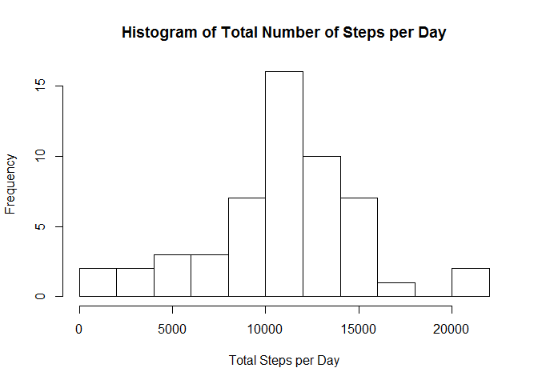
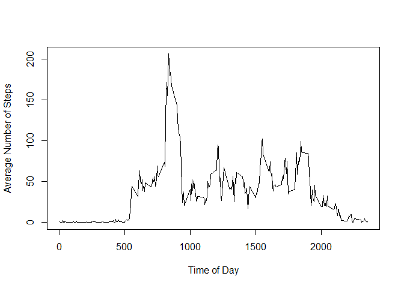
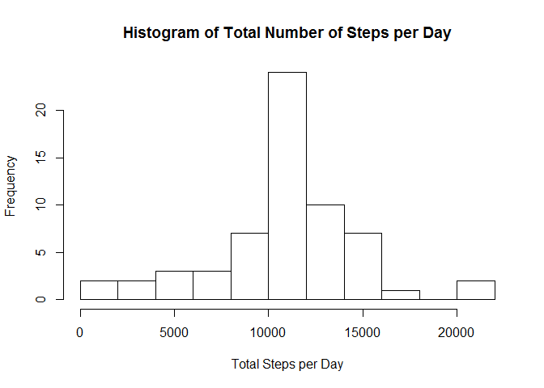
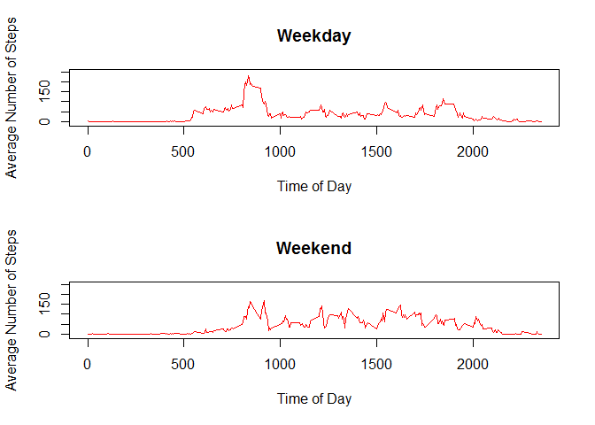

# Loading and preprocessing the data

First we read csv spreadsheet.

```r
act <- read.csv('./activity/activity.csv',stringsAsFactors = FALSE)
```
Since the date comes in character format we convert it into the date format.

```r
act$date <- as.POSIXct(act$date,format="%Y-%m-%d")
```
Similarly we convert the time intervals into time format. To do that we pad the values with leading zeros to make sure they are all of length 4. Then convert and save only the hour:minute portion.

```r
act$interval <- sprintf("%04.f",act$interval)
act$interval_time <- as.POSIXlt(act$interval,format="%H%M")
act$interval_time <- substr(act$interval_time,12,16)
```

# What is mean total number of steps taken per day?

Firstly we aggregate number of steps on day level. The histogram below provides some understanding of how number of steps per day are distributed. We are going to ingnore missing values for now.

```r
dailysum <- aggregate(steps ~ date,data=act,sum)
hist(dailysum$steps, breaks = 10, xlab = 'Total Steps per Day',main = "Histogram of Total Number of Steps per Day")
```

<!-- -->

The mean total number of steps per day is

```r
round(mean(dailysum$steps))
```

```
## [1] 10766
```
And the median total number of steps per day is

```r
round(median(dailysum$steps))
```

```
## [1] 10765
```

# What is the average daily activity pattern?

The following is the graph of average number of steps per each 5-minute time interval, which provides the approximation of daily activity pattern.

```r
timemean <- aggregate(steps ~ interval,data = act,mean)
plot(timemean$interval,timemean$steps, type = 'l',xlab = 'Time of Day',ylab = 'Average Number of Steps')
```

<!-- -->

The most active time of the day according to these calculations is

```r
timemean$interval[timemean$steps==max(timemean$steps)]
```

```
## [1] "0835"
```

# Imputing missing values

We ignored the missing values in the computations above. The overall number of missing values is

```r
miss_steps <- sum(is.na(act$steps))
```
Next we will try to impute them. I decided against using the daily averages since we have some days with _all_ values missing which would return a missing daily average as well. So we will use time interval averages.

```r
act1 <- merge(act, timemean,by = 'interval', all.x = TRUE)
act1$steps <- ifelse(is.na(act1$steps.x), act1$steps.y, act1$steps.x)
act_nona <- act1[,-c(2,5)]
```
This new data allows us to remake the histogram of total number of steps per day

```r
dailysum_nona <- aggregate(steps ~ date,data=act_nona,sum)
hist(dailysum_nona $steps, breaks = 10, xlab = 'Total Steps per Day',main = "Histogram of Total Number of Steps per Day")
```

<!-- -->

And it allows us to recalculate mean total number of steps per day

```r
round(mean(dailysum_nona $steps))
```

```
## [1] 10766
```
And it allows us to recalculate median total number of steps per day

```r
round(median(dailysum_nona $steps))
```

```
## [1] 10766
```
As we can observe the difference in results from original data and results from imputed data is insignificant.

# Are there differences in activity patterns between weekdays and weekends?

Now let's split the data into "weekend" and "weekday" to consider them separately.

```r
act_nona$day <- ifelse(weekdays(act_nona$date) %in% c('Saturday','Sunday'),'Weekend','Weekday')
act_nona$day <- as.factor(act_nona$day)
```

The activity patterns on weekdays and weekends are noticably different as can be seen from the graph below.

```r
timemean_wday <- aggregate(steps ~ interval, data = act_nona[act_nona$day=='Weekday',],mean)
timemean_wend <- aggregate(steps ~ interval, data = act_nona[act_nona$day=='Weekend',],mean)
par(mfcol=c(2,1))
plot(timemean_wday$interval,timemean_wday$steps,type = 'l',col='red',xlab = 'Time of Day',ylab = 'Average Number of Steps',ylim = c(-10,250))
title('Weekday')
plot(timemean_wend$interval,timemean_wend$steps,type = 'l',col='red',xlab = 'Time of Day',ylab = 'Average Number of Steps',ylim = c(-10,250))
title('Weekend')
```

<!-- -->

